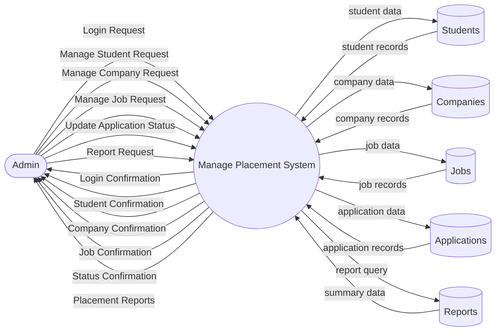

# 1st Level (Admin) DFD - Placement & Internship Management System

```mermaid
flowchart LR
    Admin([Admin])

    ManagePlacement((Manage Placement System))

    Students[(Students)]
    Companies[(Companies)]
    Jobs[(Jobs)]
    Applications[(Applications)]
    Reports[(Reports)]

    Admin -- "Login Request" --> ManagePlacement
    ManagePlacement -- "Login Confirmation" --> Admin

    Admin -- "Manage Student Request" --> ManagePlacement
    ManagePlacement -- "Student Confirmation" --> Admin

    Admin -- "Manage Company Request" --> ManagePlacement
    ManagePlacement -- "Company Confirmation" --> Admin

    Admin -- "Manage Job Request" --> ManagePlacement
    ManagePlacement -- "Job Confirmation" --> Admin

    Admin -- "Update Application Status" --> ManagePlacement
    ManagePlacement -- "Status Confirmation" --> Admin

    Admin -- "Report Request" --> ManagePlacement
    ManagePlacement -- "Placement Reports" --> Admin

    ManagePlacement -- "student data" --> Students
    Students -- "student records" --> ManagePlacement

    ManagePlacement -- "company data" --> Companies
    Companies -- "company records" --> ManagePlacement

    ManagePlacement -- "job data" --> Jobs
    Jobs -- "job records" --> ManagePlacement

    ManagePlacement -- "application data" --> Applications
    Applications -- "application records" --> ManagePlacement

    ManagePlacement -- "report query" --> Reports
    Reports -- "summary data" --> ManagePlacement
```
