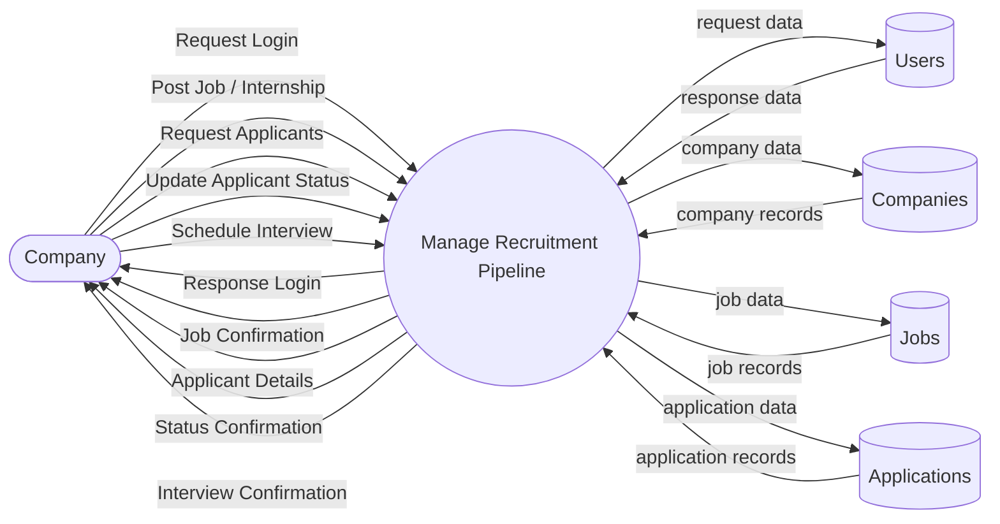

# 1st Level (Company) DFD - Placement & Internship Management System

```mermaid
flowchart LR
    Company([Company])

    ManageRecruitment((Manage Recruitment Pipeline))

    Users[(Users)]
    Companies[(Companies)]
    Jobs[(Jobs)]
    Applications[(Applications)]

    Company -- "Request Login" --> ManageRecruitment
    ManageRecruitment -- "Response Login" --> Company

    Company -- "Post Job / Internship" --> ManageRecruitment
    ManageRecruitment -- "Job Confirmation" --> Company

    Company -- "Request Applicants" --> ManageRecruitment
    ManageRecruitment -- "Applicant Details" --> Company

    Company -- "Update Applicant Status" --> ManageRecruitment
    ManageRecruitment -- "Status Confirmation" --> Company

    Company -- "Schedule Interview" --> ManageRecruitment
    ManageRecruitment -- "Interview Confirmation" --> Company

    ManageRecruitment -- "request data" --> Users
    Users -- "response data" --> ManageRecruitment

    ManageRecruitment -- "company data" --> Companies
    Companies -- "company records" --> ManageRecruitment

    ManageRecruitment -- "job data" --> Jobs
    Jobs -- "job records" --> ManageRecruitment

    ManageRecruitment -- "application data" --> Applications
    Applications -- "application records" --> ManageRecruitment
```
