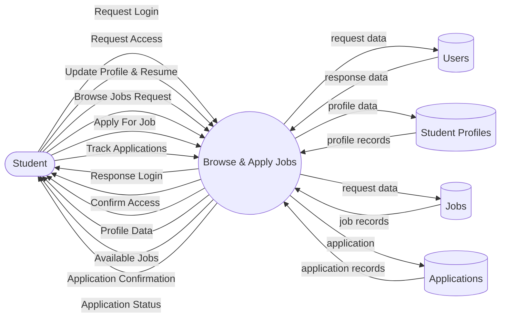

# 1st Level (Student) DFD - Placement & Internship Management System

```mermaid
flowchart LR
    Student([Student])

    BrowseApply((Browse & Apply Jobs))

    Users[(Users)]
    StudentProfiles[(Student Profiles)]
    Jobs[(Jobs)]
    Applications[(Applications)]

    Student -- "Request Login" --> BrowseApply
    BrowseApply -- "Response Login" --> Student

    Student -- "Request Access" --> BrowseApply
    BrowseApply -- "Confirm Access" --> Student

    Student -- "Update Profile & Resume" --> BrowseApply
    BrowseApply -- "Profile Data" --> Student

    Student -- "Browse Jobs Request" --> BrowseApply
    BrowseApply -- "Available Jobs" --> Student

    Student -- "Apply For Job" --> BrowseApply
    BrowseApply -- "Application Confirmation" --> Student

    Student -- "Track Applications" --> BrowseApply
    BrowseApply -- "Application Status" --> Student

    BrowseApply -- "request data" --> Users
    Users -- "response data" --> BrowseApply

    BrowseApply -- "profile data" --> StudentProfiles
    StudentProfiles -- "profile records" --> BrowseApply

    BrowseApply -- "request data" --> Jobs
    Jobs -- "job records" --> BrowseApply

    BrowseApply -- "application" --> Applications
    Applications -- "application records" --> BrowseApply
```
