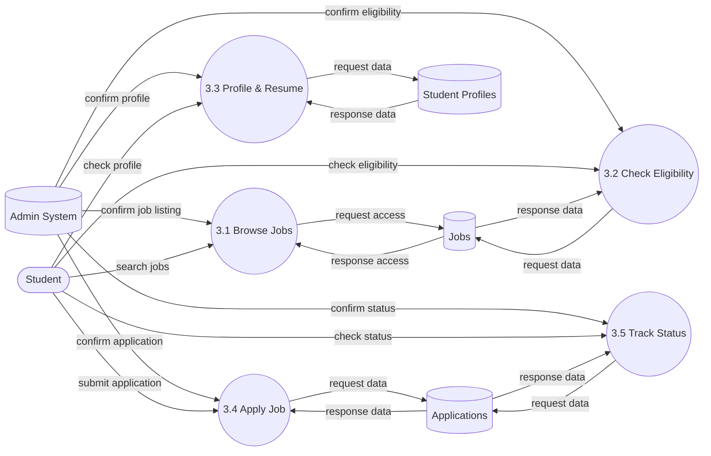

# 2nd Level Job Application (Student) DFD - Placement & Internship Management System

```mermaid
flowchart LR
    Admin[(Admin System)]
    Student([Student])

    BrowseJobs((3.1 Browse Jobs))
    CheckEligibility((3.2 Check Eligibility))
    ViewProfile((3.3 Profile & Resume))
    ApplyJob((3.4 Apply Job))
    TrackStatus((3.5 Track Status))

    JobStore[(Jobs)]
    ProfileStore[(Student Profiles)]
    ApplicationStore[(Applications)]

    Admin -- "confirm job listing" --> BrowseJobs
    Student -- "search jobs" --> BrowseJobs
    BrowseJobs -- "request access" --> JobStore
    JobStore -- "response access" --> BrowseJobs

    Admin -- "confirm eligibility" --> CheckEligibility
    Student -- "check eligibility" --> CheckEligibility
    CheckEligibility -- "request data" --> JobStore
    JobStore -- "response data" --> CheckEligibility

    Admin -- "confirm profile" --> ViewProfile
    Student -- "check profile" --> ViewProfile
    ViewProfile -- "request data" --> ProfileStore
    ProfileStore -- "response data" --> ViewProfile

    Admin -- "confirm application" --> ApplyJob
    Student -- "submit application" --> ApplyJob
    ApplyJob -- "request data" --> ApplicationStore
    ApplicationStore -- "response data" --> ApplyJob

    Admin -- "confirm status" --> TrackStatus
    Student -- "check status" --> TrackStatus
    TrackStatus -- "request data" --> ApplicationStore
    ApplicationStore -- "response data" --> TrackStatus
```
