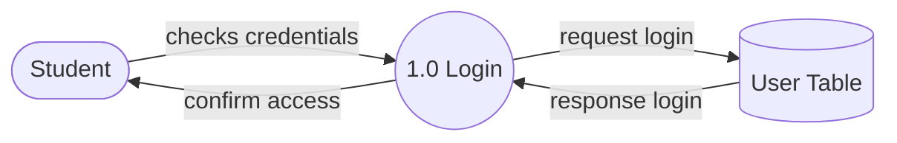

# 2nd Level Login (Student) DFD - Placement & Internship Management System

```mermaid
flowchart LR
    Student([Student])

    Login((1.0 Login))

    UserTable[(User Table)]

    Student -- "checks credentials" --> Login
    Login -- "confirm access" --> Student

    Login -- "request login" --> UserTable
    UserTable -- "response login" --> Login
```
