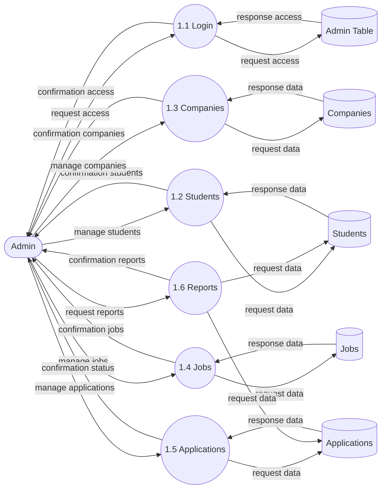

# 2nd Level Management (Admin) DFD - Placement & Internship Management System

```mermaid
flowchart LR
    Admin([Admin])

    Login((1.1 Login))
    Students((1.2 Students))
    Companies((1.3 Companies))
    Jobs((1.4 Jobs))
    Applications((1.5 Applications))
    Reports((1.6 Reports))

    LoginStore[(Admin Table)]
    StudentStore[(Students)]
    CompanyStore[(Companies)]
    JobStore[(Jobs)]
    ApplicationStore[(Applications)]

    Admin -- "request access" --> Login
    Login -- "confirmation access" --> Admin

    Login -- "request access" --> LoginStore
    LoginStore -- "response access" --> Login

    Admin -- "manage students" --> Students
    Students -- "confirmation students" --> Admin

    Students -- "request data" --> StudentStore
    StudentStore -- "response data" --> Students

    Admin -- "manage companies" --> Companies
    Companies -- "confirmation companies" --> Admin

    Companies -- "request data" --> CompanyStore
    CompanyStore -- "response data" --> Companies

    Admin -- "manage jobs" --> Jobs
    Jobs -- "confirmation jobs" --> Admin

    Jobs -- "request data" --> JobStore
    JobStore -- "response data" --> Jobs

    Admin -- "manage applications" --> Applications
    Applications -- "confirmation status" --> Admin

    Applications -- "request data" --> ApplicationStore
    ApplicationStore -- "response data" --> Applications

    Admin -- "request reports" --> Reports
    Reports -- "confirmation reports" --> Admin

    Reports -- "request data" --> StudentStore
    Reports -- "request data" --> ApplicationStore
```
