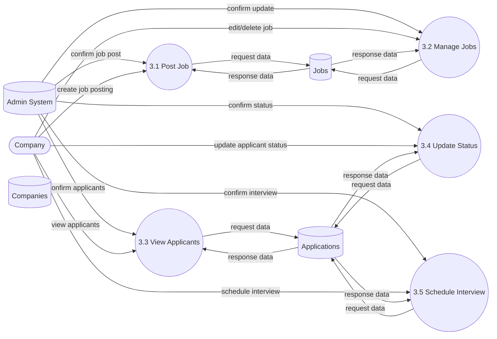

# 2nd Level Recruitment (Company) DFD - Placement & Internship Management System

```mermaid
flowchart LR
    Admin[(Admin System)]
    Company([Company])

    PostJob((3.1 Post Job))
    ManageJobs((3.2 Manage Jobs))
    ViewApplicants((3.3 View Applicants))
    UpdateStatus((3.4 Update Status))
    ScheduleInterview((3.5 Schedule Interview))

    JobStore[(Jobs)]
    ApplicationStore[(Applications)]
    CompanyStore[(Companies)]

    Admin -- "confirm job post" --> PostJob
    Company -- "create job posting" --> PostJob
    PostJob -- "request data" --> JobStore
    JobStore -- "response data" --> PostJob

    Admin -- "confirm update" --> ManageJobs
    Company -- "edit/delete job" --> ManageJobs
    ManageJobs -- "request data" --> JobStore
    JobStore -- "response data" --> ManageJobs

    Admin -- "confirm applicants" --> ViewApplicants
    Company -- "view applicants" --> ViewApplicants
    ViewApplicants -- "request data" --> ApplicationStore
    ApplicationStore -- "response data" --> ViewApplicants

    Admin -- "confirm status" --> UpdateStatus
    Company -- "update applicant status" --> UpdateStatus
    UpdateStatus -- "request data" --> ApplicationStore
    ApplicationStore -- "response data" --> UpdateStatus

    Admin -- "confirm interview" --> ScheduleInterview
    Company -- "schedule interview" --> ScheduleInterview
    ScheduleInterview -- "request data" --> ApplicationStore
    ApplicationStore -- "response data" --> ScheduleInterview
```
