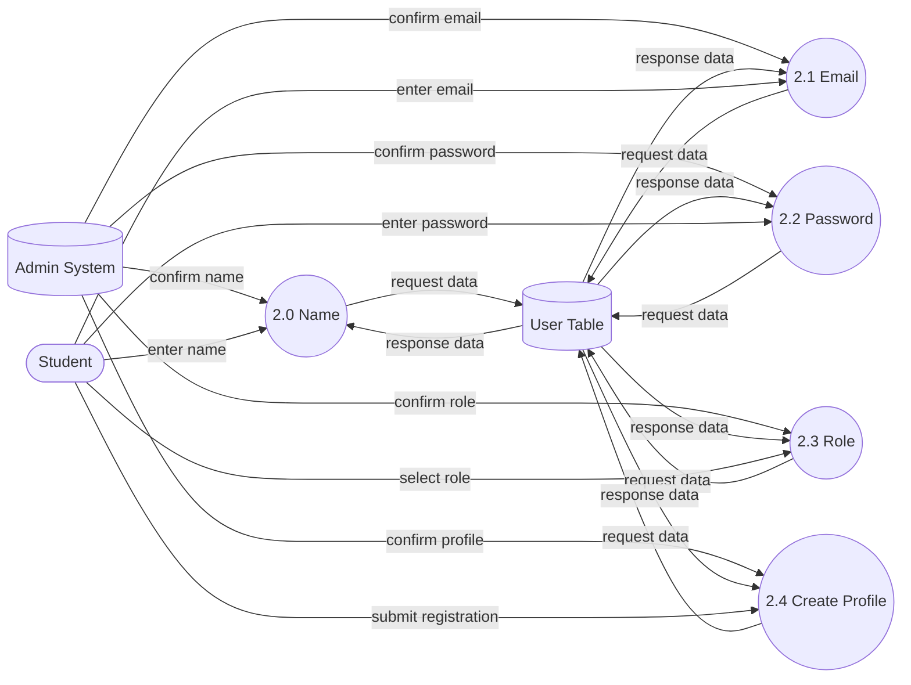

# 2nd Level Registration (Student) DFD - Placement & Internship Management System

```mermaid
flowchart LR
    Admin[(Admin System)]
    Student([Student])

    ValidateName((2.0 Name))
    ValidateEmail((2.1 Email))
    ValidatePassword((2.2 Password))
    ValidateRole((2.3 Role))
    CreateProfile((2.4 Create Profile))

    UserTable[(User Table)]

    Admin -- "confirm name" --> ValidateName
    ValidateName -- "request data" --> UserTable
    UserTable -- "response data" --> ValidateName
    Student -- "enter name" --> ValidateName

    Admin -- "confirm email" --> ValidateEmail
    ValidateEmail -- "request data" --> UserTable
    UserTable -- "response data" --> ValidateEmail
    Student -- "enter email" --> ValidateEmail

    Admin -- "confirm password" --> ValidatePassword
    ValidatePassword -- "request data" --> UserTable
    UserTable -- "response data" --> ValidatePassword
    Student -- "enter password" --> ValidatePassword

    Admin -- "confirm role" --> ValidateRole
    ValidateRole -- "request data" --> UserTable
    UserTable -- "response data" --> ValidateRole
    Student -- "select role" --> ValidateRole

    Admin -- "confirm profile" --> CreateProfile
    CreateProfile -- "request data" --> UserTable
    UserTable -- "response data" --> CreateProfile
    Student -- "submit registration" --> CreateProfile
```
