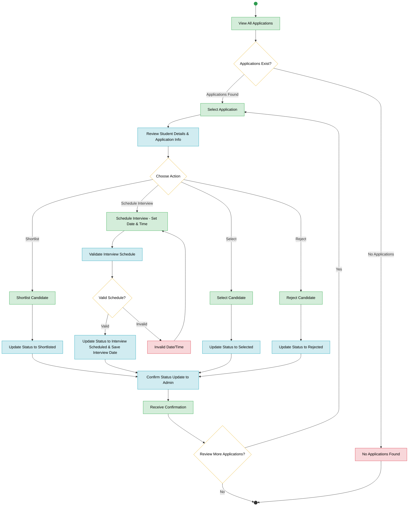

# Activity Flow Diagram - Admin Application & Interview Management

```mermaid
flowchart TD
    Start(( )):::startNode

    ViewApplications["View All Applications"]:::adminAction
    CheckApplications{"Applications Exist?"}:::decision
    NoApps["No Applications Found"]:::errorAction

    SelectApplication["Select Application"]:::adminAction
    ReviewDetails["Review Student Details & Application Info"]:::systemAction

    DecideAction{"Choose Action"}:::decision

    Shortlist["Shortlist Candidate"]:::adminAction
    UpdateShortlist["Update Status to Shortlisted"]:::systemAction

    ScheduleInterview["Schedule Interview - Set Date & Time"]:::adminAction
    ValidateSchedule["Validate Interview Schedule"]:::systemAction
    InvalidSchedule["Invalid Date/Time"]:::errorAction
    ValidSchedule{"Valid Schedule?"}:::decision
    ConfirmInterview["Update Status to Interview Scheduled & Save Interview Date"]:::systemAction

    SelectCandidate["Select Candidate"]:::adminAction
    UpdateSelected["Update Status to Selected"]:::systemAction

    RejectCandidate["Reject Candidate"]:::adminAction
    UpdateRejected["Update Status to Rejected"]:::systemAction

    SendConfirmation["Confirm Status Update to Admin"]:::systemAction
    ReceiveConfirmation["Receive Confirmation"]:::adminAction

    CheckMore{"Review More Applications?"}:::decision

    EndNode(( )):::endNode

    Start --> ViewApplications
    ViewApplications --> CheckApplications

    CheckApplications -- "Applications Found" --> SelectApplication
    CheckApplications -- "No Applications" --> NoApps
    NoApps --> EndNode

    SelectApplication --> ReviewDetails
    ReviewDetails --> DecideAction

    DecideAction -- "Shortlist" --> Shortlist
    DecideAction -- "Schedule Interview" --> ScheduleInterview
    DecideAction -- "Select" --> SelectCandidate
    DecideAction -- "Reject" --> RejectCandidate

    Shortlist --> UpdateShortlist
    UpdateShortlist --> SendConfirmation

    ScheduleInterview --> ValidateSchedule
    ValidateSchedule --> ValidSchedule
    ValidSchedule -- "Valid" --> ConfirmInterview
    ValidSchedule -- "Invalid" --> InvalidSchedule
    InvalidSchedule --> ScheduleInterview
    ConfirmInterview --> SendConfirmation

    SelectCandidate --> UpdateSelected
    UpdateSelected --> SendConfirmation

    RejectCandidate --> UpdateRejected
    UpdateRejected --> SendConfirmation

    SendConfirmation --> ReceiveConfirmation
    ReceiveConfirmation --> CheckMore

    CheckMore -- "Yes" --> SelectApplication
    CheckMore -- "No" --> EndNode

    classDef startNode fill:#2d9b4e,stroke:#2d9b4e,color:#fff
    classDef endNode fill:#333,stroke:#333,color:#fff
    classDef adminAction fill:#d4edda,stroke:#28a745,color:#000
    classDef systemAction fill:#d1ecf1,stroke:#17a2b8,color:#000
    classDef errorAction fill:#f8d7da,stroke:#dc3545,color:#000
    classDef decision fill:#fff,stroke:#e6a800,color:#000
```
