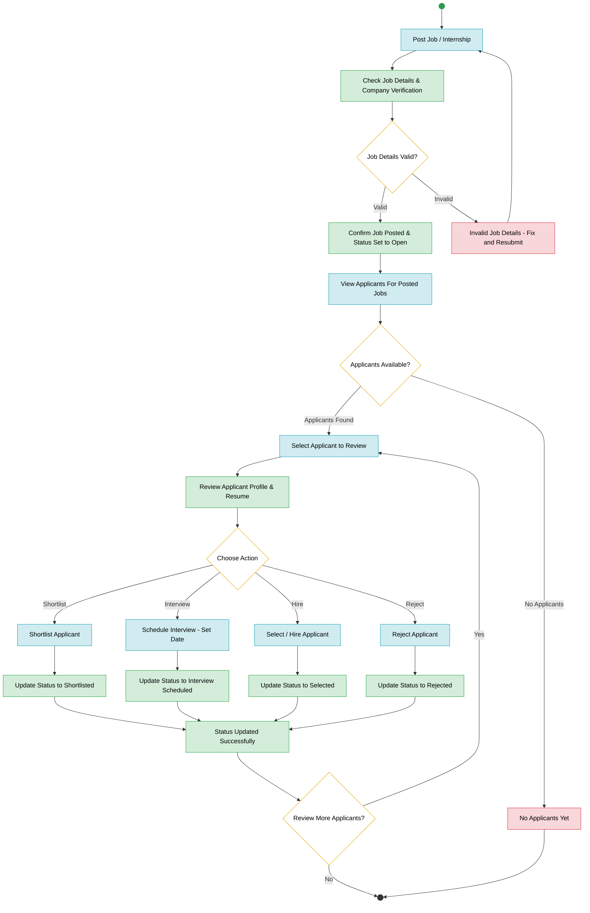

# Activity Flow Diagram - Company Recruitment Process

```mermaid
flowchart TD
    Start(( )):::startNode

    PostJob["Post Job / Internship"]:::companyAction
    CheckJobDetails["Check Job Details & Company Verification"]:::systemAction
    JobValid{"Job Details Valid?"}:::decision
    InvalidJob["Invalid Job Details - Fix and Resubmit"]:::errorAction
    ConfirmJob["Confirm Job Posted & Status Set to Open"]:::systemAction

    ViewApplicants["View Applicants For Posted Jobs"]:::companyAction
    CheckApplicants{"Applicants Available?"}:::decision
    NoApplicants["No Applicants Yet"]:::errorAction

    SelectApplicant["Select Applicant to Review"]:::companyAction
    ReviewProfile["Review Applicant Profile & Resume"]:::systemAction

    DecideAction{"Choose Action"}:::decision

    ShortlistApplicant["Shortlist Applicant"]:::companyAction
    UpdateShortlist["Update Status to Shortlisted"]:::systemAction

    ScheduleInterview["Schedule Interview - Set Date"]:::companyAction
    ConfirmInterview["Update Status to Interview Scheduled"]:::systemAction

    HireApplicant["Select / Hire Applicant"]:::companyAction
    ConfirmHire["Update Status to Selected"]:::systemAction

    RejectApplicant["Reject Applicant"]:::companyAction
    ConfirmReject["Update Status to Rejected"]:::systemAction

    StatusUpdated["Status Updated Successfully"]:::systemAction

    CheckMore{"Review More Applicants?"}:::decision

    EndNode(( )):::endNode

    Start --> PostJob
    PostJob --> CheckJobDetails
    CheckJobDetails --> JobValid

    JobValid -- "Valid" --> ConfirmJob
    JobValid -- "Invalid" --> InvalidJob
    InvalidJob --> PostJob

    ConfirmJob --> ViewApplicants
    ViewApplicants --> CheckApplicants

    CheckApplicants -- "Applicants Found" --> SelectApplicant
    CheckApplicants -- "No Applicants" --> NoApplicants
    NoApplicants --> EndNode

    SelectApplicant --> ReviewProfile
    ReviewProfile --> DecideAction

    DecideAction -- "Shortlist" --> ShortlistApplicant
    DecideAction -- "Interview" --> ScheduleInterview
    DecideAction -- "Hire" --> HireApplicant
    DecideAction -- "Reject" --> RejectApplicant

    ShortlistApplicant --> UpdateShortlist --> StatusUpdated
    ScheduleInterview --> ConfirmInterview --> StatusUpdated
    HireApplicant --> ConfirmHire --> StatusUpdated
    RejectApplicant --> ConfirmReject --> StatusUpdated

    StatusUpdated --> CheckMore

    CheckMore -- "Yes" --> SelectApplicant
    CheckMore -- "No" --> EndNode

    classDef startNode fill:#2d9b4e,stroke:#2d9b4e,color:#fff
    classDef endNode fill:#333,stroke:#333,color:#fff
    classDef companyAction fill:#d1ecf1,stroke:#17a2b8,color:#000
    classDef systemAction fill:#d4edda,stroke:#28a745,color:#000
    classDef errorAction fill:#f8d7da,stroke:#dc3545,color:#000
    classDef decision fill:#fff,stroke:#e6a800,color:#000
```
