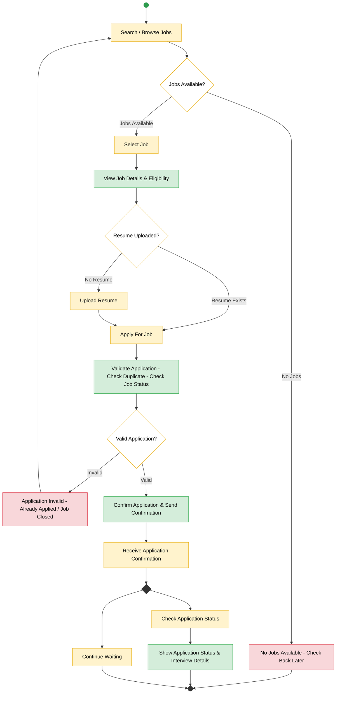

# Activity Flow Diagram - Student Job Application Process

```mermaid
flowchart TD
    Start(( )):::startNode

    SearchJobs["Search / Browse Jobs"]:::studentAction
    CheckJobs{"Jobs Available?"}:::decision
    NoJobs["No Jobs Available - Check Back Later"]:::errorAction

    SelectJob["Select Job"]:::studentAction
    ViewDetails["View Job Details & Eligibility"]:::systemAction

    CheckResume{"Resume Uploaded?"}:::decision
    UploadResume["Upload Resume"]:::studentAction

    ApplyJob["Apply For Job"]:::studentAction
    ValidateApplication["Validate Application - Check Duplicate - Check Job Status"]:::systemAction

    InvalidApp["Application Invalid - Already Applied / Job Closed"]:::errorAction
    ValidApp{"Valid Application?"}:::decision

    ConfirmApplication["Confirm Application & Send Confirmation"]:::systemAction
    ReceiveConfirmation["Receive Application Confirmation"]:::studentAction

    Fork1{ }:::forkNode

    CheckStatus["Check Application Status"]:::studentAction
    ShowStatus["Show Application Status & Interview Details"]:::systemAction

    CancelCheck["Continue Waiting"]:::studentAction

    EndNode(( )):::endNode

    Start --> SearchJobs
    SearchJobs --> CheckJobs

    CheckJobs -- "Jobs Available" --> SelectJob
    CheckJobs -- "No Jobs" --> NoJobs
    NoJobs --> EndNode

    SelectJob --> ViewDetails
    ViewDetails --> CheckResume

    CheckResume -- "Resume Exists" --> ApplyJob
    CheckResume -- "No Resume" --> UploadResume
    UploadResume --> ApplyJob

    ApplyJob --> ValidateApplication
    ValidateApplication --> ValidApp

    ValidApp -- "Valid" --> ConfirmApplication
    ValidApp -- "Invalid" --> InvalidApp
    InvalidApp --> SearchJobs

    ConfirmApplication --> ReceiveConfirmation
    ReceiveConfirmation --> Fork1

    Fork1 --> CheckStatus
    Fork1 --> CancelCheck

    CheckStatus --> ShowStatus
    ShowStatus --> EndNode
    CancelCheck --> EndNode

    classDef startNode fill:#2d9b4e,stroke:#2d9b4e,color:#fff
    classDef endNode fill:#333,stroke:#333,color:#fff
    classDef studentAction fill:#fff3cd,stroke:#e6a800,color:#000
    classDef systemAction fill:#d4edda,stroke:#28a745,color:#000
    classDef errorAction fill:#f8d7da,stroke:#dc3545,color:#000
    classDef decision fill:#fff,stroke:#e6a800,color:#000,shape:diamond
    classDef forkNode fill:#333,stroke:#333,color:#fff
```
