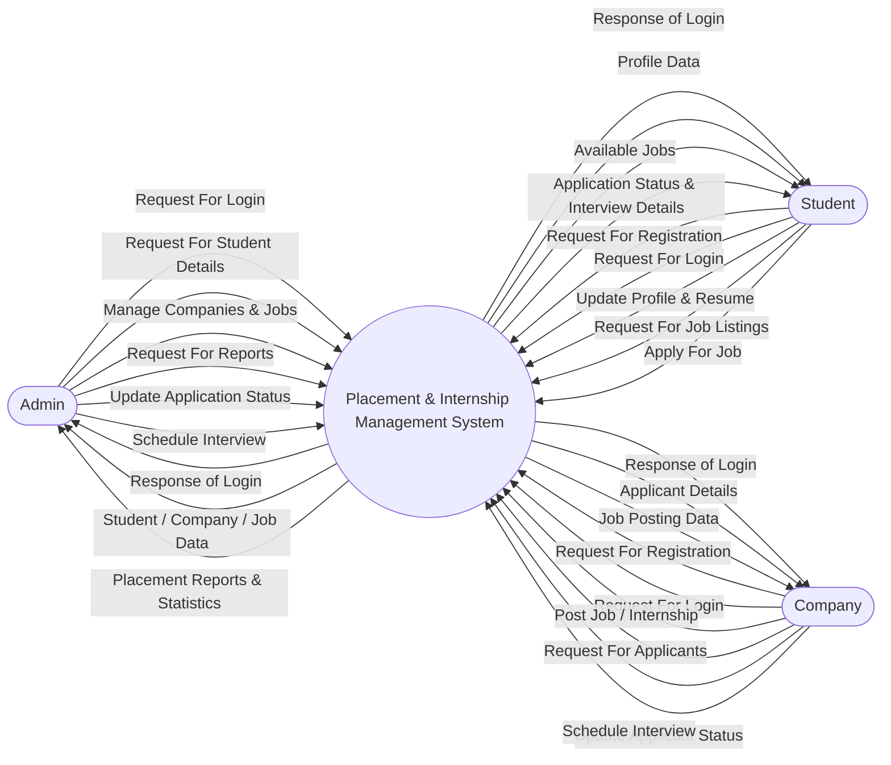

# Context-Level DFD - Placement & Internship Management System (PIMS)

```mermaid
flowchart LR
    Admin([Admin])
    Student([Student])
    Company([Company])

    PIMS((Placement & Internship Management System))

    Admin -- "Request For Login" --> PIMS
    PIMS -- "Response of Login" --> Admin
    Admin -- "Request For Student Details" --> PIMS
    PIMS -- "Student / Company / Job Data" --> Admin
    Admin -- "Manage Companies & Jobs" --> PIMS
    Admin -- "Request For Reports" --> PIMS
    PIMS -- "Placement Reports & Statistics" --> Admin
    Admin -- "Update Application Status" --> PIMS
    Admin -- "Schedule Interview" --> PIMS

    Student -- "Request For Registration" --> PIMS
    Student -- "Request For Login" --> PIMS
    PIMS -- "Response of Login" --> Student
    Student -- "Update Profile & Resume" --> PIMS
    PIMS -- "Profile Data" --> Student
    Student -- "Request For Job Listings" --> PIMS
    PIMS -- "Available Jobs" --> Student
    Student -- "Apply For Job" --> PIMS
    PIMS -- "Application Status & Interview Details" --> Student

    Company -- "Request For Registration" --> PIMS
    Company -- "Request For Login" --> PIMS
    PIMS -- "Response of Login" --> Company
    Company -- "Post Job / Internship" --> PIMS
    Company -- "Request For Applicants" --> PIMS
    PIMS -- "Applicant Details" --> Company
    Company -- "Update Applicant Status" --> PIMS
    Company -- "Schedule Interview" --> PIMS
    PIMS -- "Job Posting Data" --> Company
```
