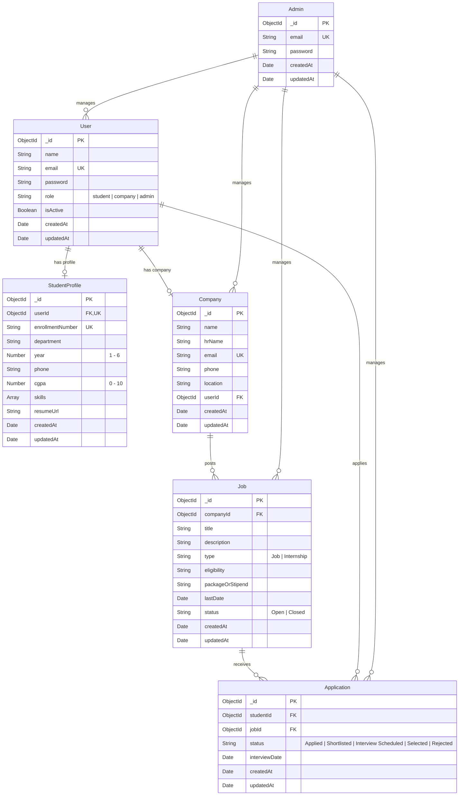

# Entity-Relationship Diagram / Class Diagram - Placement & Internship Management System

```mermaid
erDiagram
    User {
        ObjectId _id PK
        String name
        String email UK
        String password
        String role "student | company | admin"
        Boolean isActive
        Date createdAt
        Date updatedAt
    }

    Admin {
        ObjectId _id PK
        String email UK
        String password
        Date createdAt
        Date updatedAt
    }

    StudentProfile {
        ObjectId _id PK
        ObjectId userId FK, UK
        String enrollmentNumber UK
        String department
        Number year "1 - 6"
        String phone
        Number cgpa "0 - 10"
        Array skills
        String resumeUrl
        Date createdAt
        Date updatedAt
    }

    Company {
        ObjectId _id PK
        String name
        String hrName
        String email UK
        String phone
        String location
        ObjectId userId FK
        Date createdAt
        Date updatedAt
    }

    Job {
        ObjectId _id PK
        ObjectId companyId FK
        String title
        String description
        String type "Job | Internship"
        String eligibility
        String packageOrStipend
        Date lastDate
        String status "Open | Closed"
        Date createdAt
        Date updatedAt
    }

    Application {
        ObjectId _id PK
        ObjectId studentId FK
        ObjectId jobId FK
        String status "Applied | Shortlisted | Interview Scheduled | Selected | Rejected"
        Date interviewDate
        Date createdAt
        Date updatedAt
    }

    User ||--o| StudentProfile : "has profile"
    User ||--o| Company : "has company"
    Company ||--o{ Job : "posts"
    Job ||--o{ Application : "receives"
    User ||--o{ Application : "applies"
    Admin ||--o{ User : "manages"
    Admin ||--o{ Company : "manages"
    Admin ||--o{ Job : "manages"
    Admin ||--o{ Application : "manages"
```
