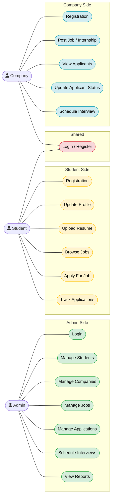

# UML Use Case Detailed Diagram - Placement & Internship Management System

```mermaid
flowchart LR
    Admin(["fa:fa-user Admin"])
    Student(["fa:fa-user Student"])
    Company(["fa:fa-user Company"])

    subgraph AdminSide["Admin Side"]
        direction TB
        A1([Login]):::admin
        A2([Manage Students]):::admin
        A3([Manage Companies]):::admin
        A4([Manage Jobs]):::admin
        A5([Manage Applications]):::admin
        A6([Schedule Interviews]):::admin
        A7([View Reports]):::admin
    end

    subgraph SharedActions["Shared"]
        direction TB
        S1([Login / Register]):::shared
    end

    subgraph StudentSide["Student Side"]
        direction TB
        ST1([Registration]):::student
        ST2([Update Profile]):::student
        ST3([Upload Resume]):::student
        ST4([Browse Jobs]):::student
        ST5([Apply For Job]):::student
        ST6([Track Applications]):::student
    end

    subgraph CompanySide["Company Side"]
        direction TB
        C1([Registration]):::company
        C2([Post Job / Internship]):::company
        C3([View Applicants]):::company
        C4([Update Applicant Status]):::company
        C5([Schedule Interview]):::company
    end

    Admin --- A1
    Admin --- A2
    Admin --- A3
    Admin --- A4
    Admin --- A5
    Admin --- A6
    Admin --- A7

    Student --- S1
    Student --- ST1
    Student --- ST2
    Student --- ST3
    Student --- ST4
    Student --- ST5
    Student --- ST6

    Company --- S1
    Company --- C1
    Company --- C2
    Company --- C3
    Company --- C4
    Company --- C5

    classDef admin fill:#d4edda,stroke:#28a745,color:#000
    classDef student fill:#fff3cd,stroke:#ffc107,color:#000
    classDef company fill:#d1ecf1,stroke:#17a2b8,color:#000
    classDef shared fill:#f8d7da,stroke:#dc3545,color:#000
```
