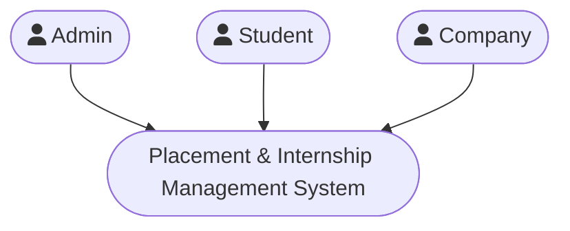

# UML Use Case Diagram - Placement & Internship Management System

```mermaid
flowchart TB
    AdminActor(["fa:fa-user Admin"])
    StudentActor(["fa:fa-user Student"])
    CompanyActor(["fa:fa-user Company"])

    PIMS(["Placement & Internship Management System"])

    AdminActor --> PIMS
    StudentActor --> PIMS
    CompanyActor --> PIMS
```
